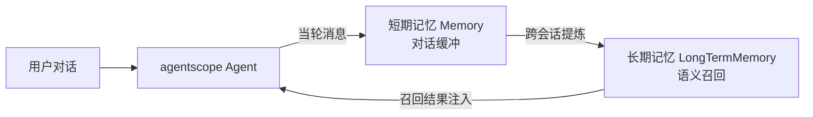
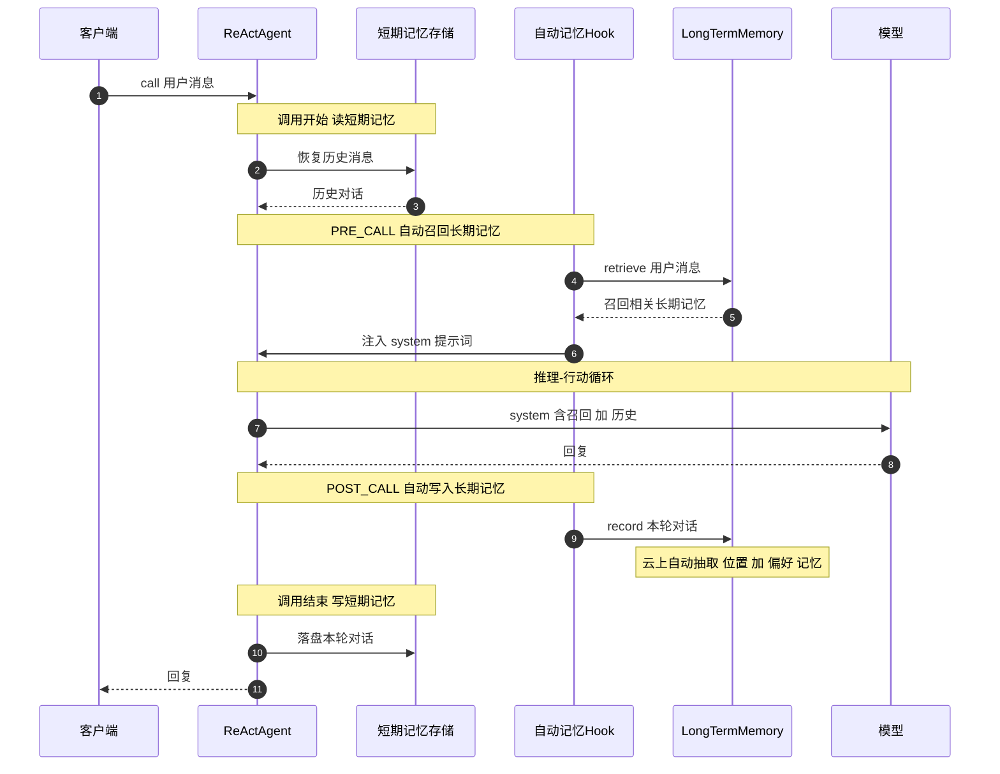
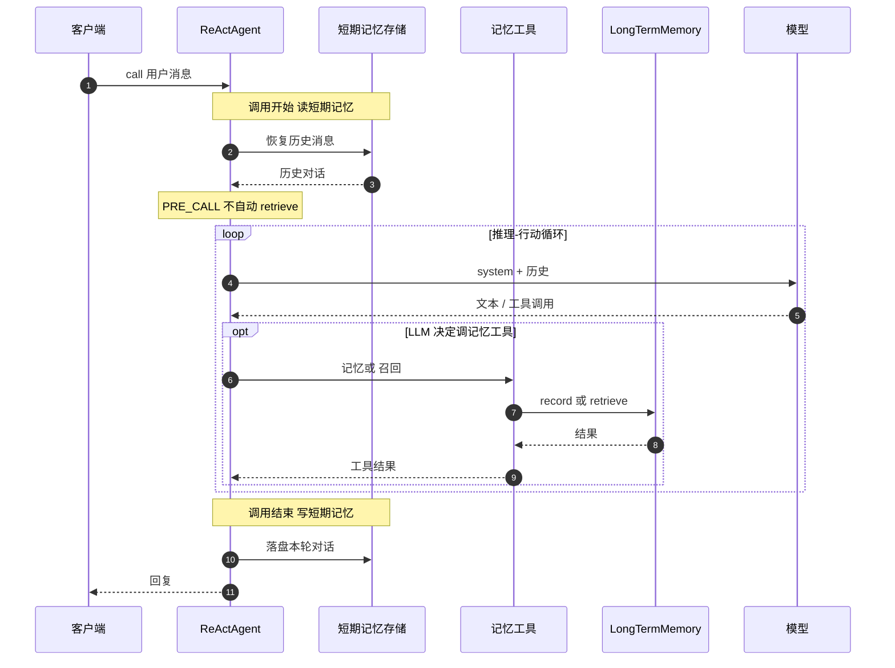
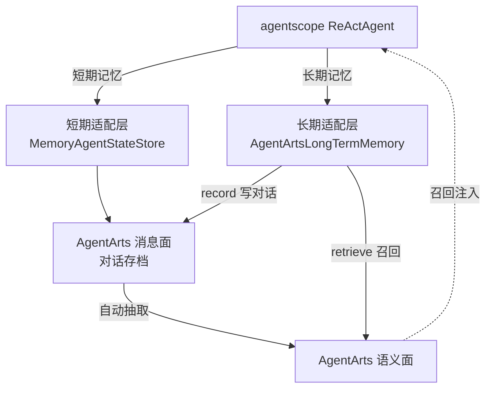
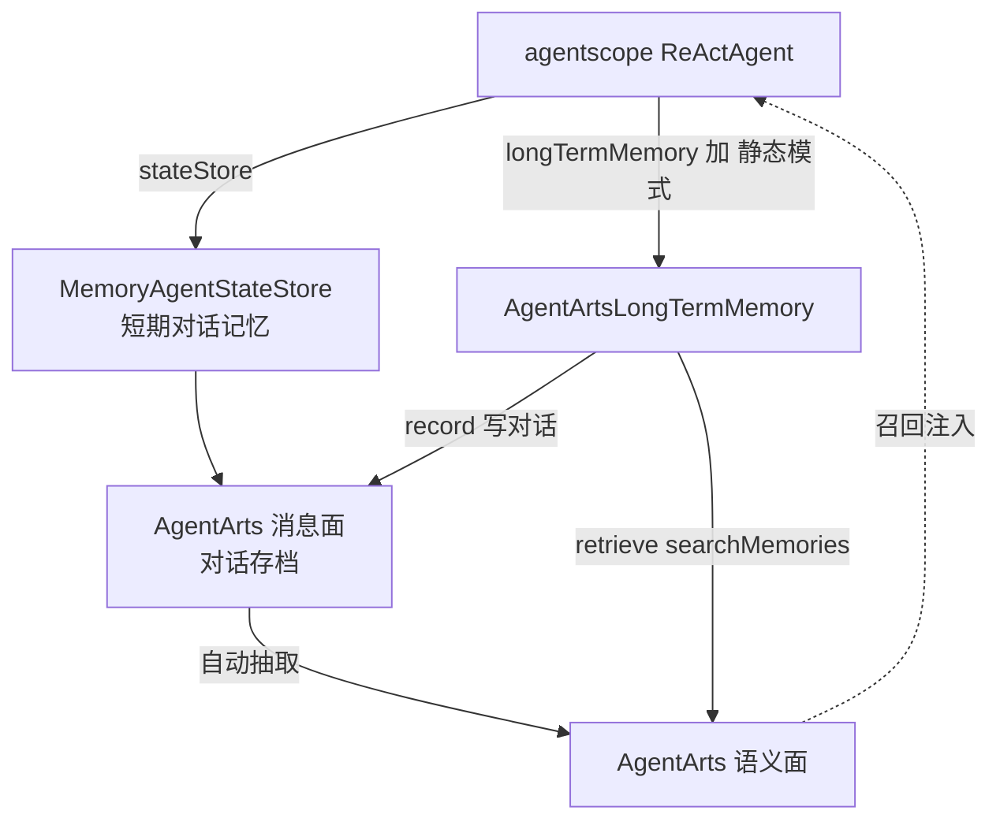
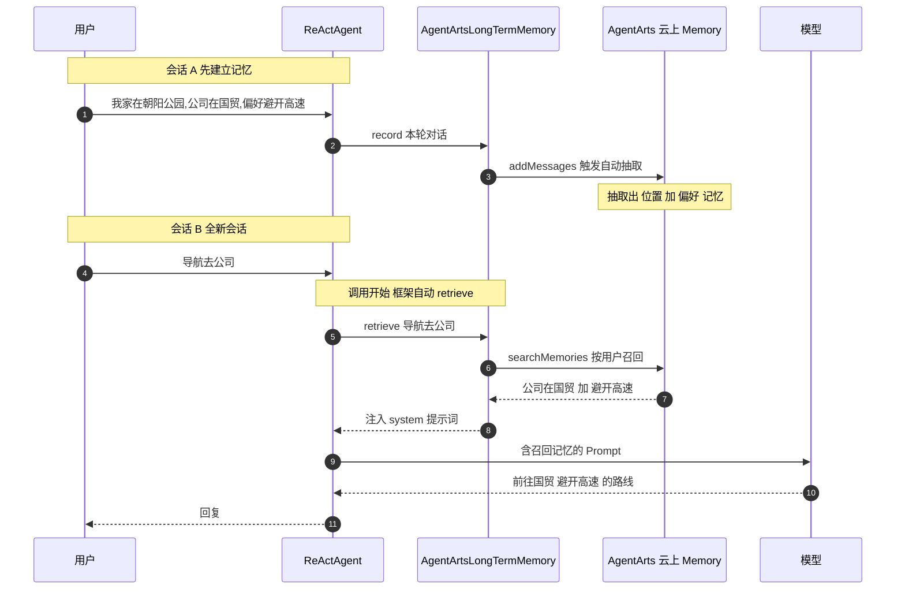

# AgentArts Memory 接入 agentscope —— 客户集成指南

> 面向使用 [agentscope-java](https://github.com/agentscope-ai/agentscope-java) 构建 Agent、
> 希望把记忆接到华为云 AgentArts Memory 的客户。本文不讲内部实现细节，只讲清三件事：
> **agentscope 的记忆怎么运作 → AgentArts 做了哪些适配 → 怎么集成最好**。

---

## 1. agentscope 的记忆是怎么工作的

agentscope 把 Agent 的记忆分成**两层**，各司其职：

### 1.1 两层记忆：短期 + 长期

| 层 | 接口 | 作用 | 默认 |
|---|---|---|---|
| **短期记忆** | `Memory` | 当前会话的**对话消息缓冲**（user/assistant/tool 的消息），随 Agent 运行时存取 | 进程内（重启即失） |
| **长期记忆** | `LongTermMemory` | 跨会话的**语义记忆**：把对话提炼成可检索的长期记忆，下次按相关性召回 | core 无；`agentscope-extensions` 提供 mem0 / 百炼 / ReMe 等现成实现，AgentArts 同样以扩展形式对接 |

两个接口都很简洁：

```java
interface Memory {            // 短期：对话消息缓冲
    void addMessage(Msg);
    List<Msg> getMessages();
    ...
}

interface LongTermMemory {    // 长期：写入 + 召回
    Mono<Void>   record(List<Msg> messages);   // 写入长期记忆
    Mono<String> retrieve(Msg query);          // 召回相关记忆，返回可注入 Prompt 的字符串
}
```

两层关系：



> **一句话**：短期记忆是"这一会话聊了啥"，长期记忆是"跨会话记住的偏好/事实/经历"。

### 1.2 长期记忆的三种模式（由谁触发 record/retrieve）

长期记忆的 `record`/`retrieve` 谁来调、何时调，由 `LongTermMemoryMode` 决定；短期记忆的读写则在每次调用边界（见下方完整流程）：

| 模式 | 触发方 | 特点 |
|---|---|---|
| **STATIC_CONTROL** | 框架自动 | 每轮自动 record + retrieve 并注入 Prompt，零侵入，LLM 无感 |
| **AGENT_CONTROL** | LLM 自主 | LLM 决定何时记忆/召回（通过工具），灵活但可能漏调 |
| **BOTH** | 两者兼有 | 自动 + 工具都开 |

### 1.3 完整调用流程（STATIC_CONTROL 模式）

一张图看清短期记忆与长期记忆如何在一次调用中协同（短期在调用边界读写、长期在 PRE/POST_CALL 自动召回与写入）：



- **短期记忆**：调用开始恢复历史消息、调用结束落盘本轮对话（边界读写）；默认进程内，重启即失、多实例不共享——这正是上云要解决的问题。
- **长期记忆**：`PRE_CALL` 自动 retrieve 召回并注入 Prompt；`POST_CALL` 自动 record 本轮对话 → 云上自动抽取成可检索记忆。

### 1.4 AGENT_CONTROL 模式

与 STATIC 不同，`retrieve`/`record` 不在调用边界自动触发，而由 LLM 在推理-行动循环里自主调用记忆工具（短期记忆的边界读写仍存在）：



> 与 STATIC 的区别**只在长期记忆**：AGENT 模式下 `retrieve`/`record` 不在调用边界自动触发，而由 LLM 在循环里自主调记忆工具。**短期记忆的边界读写（开始恢复历史、结束落盘）两种模式都有**。
>
> **模式选择**：STATIC_CONTROL 零侵入、开箱即用；AGENT_CONTROL 由 LLM 自主决定记忆/召回，灵活但可能漏调；BOTH 两者兼开。按场景选择。

---

## 2. AgentArts 做了哪些适配

AgentArts Memory 提供云上的**消息面**（对话消息存储 + 自动抽取）与**语义记忆面**（按语义检索召回），分别对接 agentscope 的两层记忆：



### 2.1 长期记忆适配层：`AgentArtsLongTermMemory`

实现 agentscope 的 `LongTermMemory` 接口，两个方法对接云上：

| agentscope | AgentArts | 效果 |
|---|---|---|
| `record(List<Msg>)` | `addMessages`（原生消息） | 写入对话，**触发云上自动抽取**（偏好/事实/经历） |
| `retrieve(Msg)` | `searchMemories` | 按**用户(actor)跨会话**语义召回，返回字符串注入 Prompt |

接进 Agent 只需两行：

```java
ReActAgent agent = ReActAgent.builder()
        .name("my-agent").sysPrompt(...).model(model).toolkit(toolkit)
        .longTermMemory(new AgentArtsLongTermMemory(memoryClient, spaceId, userId))  // ★ 长期记忆
        .longTermMemoryMode(LongTermMemoryMode.STATIC_CONTROL)                       // ★ 自动模式
        .build();
```

- **按用户隔离 + 跨会话召回**：记忆按 `userId`（actor）在云上隔离与检索，换会话也不忘。
- **自动抽取**：云上从对话自动提炼语义/偏好/经历记忆，无需自建 embedding + 抽取链路。
- **容错**：记忆读写失败不影响主对话（降级为空）。

### 2.2 短期记忆适配层：`MemoryAgentStateStore`

把 agentscope 的短期对话记忆持久化到云上，跨实例可恢复：

```java
        .stateStore(new MemoryAgentStateStore(memoryClient, spaceId))  // ★ 短期记忆上云
```

- 对话历史 + Agent 工作状态跨进程/跨实例持久化；
- 重启或横向扩容后，新实例能恢复同一用户会话的对话上下文。

### 2.3 两个适配层组合

短期与长期**正交**，组合使用，都落到 AgentArts Memory：

```java
MemoryClient client = new MemoryClient(region, memoryApiKey);

ReActAgent agent = ReActAgent.builder()
        .name("my-agent").sysPrompt(BASE_PROMPT).model(model).toolkit(toolkit)
        .stateStore(new MemoryAgentStateStore(client, spaceId))                    // 短期记忆
        .longTermMemory(new AgentArtsLongTermMemory(client, spaceId, userId))      // 长期记忆
        .longTermMemoryMode(LongTermMemoryMode.STATIC_CONTROL)
        .build();
```

---

## 3. 集成 AgentArts Memory 的最佳实践

### 3.1 推荐架构（长短记忆共用 AgentArts）



**长短共用的协同点**：长期记忆 `record` 把真实对话以原生消息写入 AgentArts 消息面 → 云上自动抽取成长期记忆；同一次写入也让对话原文留存（兼具短期存档意义）。**一次写入，短期存档 + 长期抽取两用**。

### 3.2 最佳实践清单

1. **实现 agentscope 原生接口，不自造抽象** —— `AgentArtsLongTermMemory` 实现 `LongTermMemory`，复用 agentscope 的模式/Hook/工具机制，升级不受影响，零侵入。
2. **起步用 STATIC_CONTROL** —— 框架自动 record/retrieve + 注入 Prompt，最省心；确需"模型自主决定记忆"再切 AGENT_CONTROL。
3. **按用户(actor)隔离 + 跨会话召回** —— 用稳定用户 ID 作 `actorId`；云上按 actor 检索，实现"换会话也不忘"。
4. **写即抽取** —— 每轮对话都 `record`，让云上自动抽取，不要自己写 embedding/抽取链路。
5. **召回而非全量** —— `retrieve` 用 topK=3~5，只注入相关记忆，控制 token 成本与噪声。
6. **短期/长期分离** —— 短期对话走 `MemoryAgentStateStore`，长期语义走 `AgentArtsLongTermMemory`，正交勿混。
7. **异步 + 容错** —— 开启异步 record（`longTermMemoryAsyncRecord`），记忆读写失败降级不阻塞主对话。
8. **可降级** —— 无云凭据时用离线实现做本地开发/Demo，上云只换实现类。

### 3.3 三步上云

```bash
# 1) 建 Memory Space（控制面，需 AK/SK）—— 产出 spaceId + 数据面 apiKey
#    可用 SDK: new MemoryClient().createSpace("my-space")
#    或用 CLI:  agentarts memory create-space --name my-space

# 2) 配置环境变量（demo 自带 .env + run-demo.sh 一键加载）
cd agentarts-sdk-examples
cp .env.example .env   # 填 AGENTARTS_MEMORY_API_KEY / SPACE_ID / OPENAI_API_KEY

# 3) 跑导航 demo（自动按 .env 选模式）
./run-demo.sh nav
```

---

## 4. 导航场景 Demo

**代码**：`agentarts-sdk-examples/.../memory/NavigationLongTermMemoryDemo.java`

### 4.1 场景设计意图

导航是体现"长期记忆价值"的典型场景——助手需要记住用户的**家/公司位置（事实）**、**避开高速的偏好（偏好）**、**去过哪（经历）**，跨会话复用。demo 用三段对话把记忆链路完整走一遍：

| 阶段 | 用户输入 | 验证什么 |
|---|---|---|
| 会话 A | "我家在朝阳公园南门，公司在国贸，偏好避开高速公路" | **写入 + 自动抽取**：对话 `record` 到云上，云上自动提炼出位置/偏好记忆 |
| 会话 B（全新会话） | "导航去公司" | **跨会话召回**：按用户在云上召回公司位置 + 避开高速偏好 → 直接给路线 |
| 对照（另一用户） | "导航去公司" | **按用户隔离**：另一用户无记忆 → 召回为空 → 提示信息不足 |

### 4.2 调用流程（对应 STATIC_CONTROL 模式）

会话 B 是关键——它是**全新会话**（与 A 不同 sessionId），却能在调用前 `retrieve` 到 A 写入的记忆，这正是"跨会话召回"的证明：



### 4.3 实际运行输出（上云 + 真实 LLM）

会话 B 的关键输出（`LoggingLongTermMemory` 装饰器把黑盒的 record/retrieve 调用打印出来）：

```
👤 用户: 导航去公司
  ┌─ [AgentArtsLTM] retrieve() 被调用，query=导航去公司
  └─ [AgentArtsLTM] retrieve() 召回:
      [已从云上召回的长期记忆 · actor=user-zhangsan]
      ... <global_summary>记录用户张三的住址（朝阳公园南门）、公司（国贸）...</global_summary>
      ... {"fact": "用户通勤时偏好避开高速公路。"}
🤖 助手: 已为您调用保存的通勤信息。正在为您规划前往公司（国贸）的路线，
        已自动应用您"避开高速公路"的出行偏好 ... 全程避开高速及快速路主路。
```

模型**用上了云上召回的记忆**：认出公司=国贸、应用了避开高速偏好。整条链路（框架自动 retrieve → `AgentArtsLongTermMemory` → 云上 `searchMemories` → 注入 Prompt → LLM 据此回答）真实跑通。

### 4.4 demo 对应的最佳实践

| demo 体现的实践 | 在 demo 中如何体现 |
|---|---|
| 实现 `LongTermMemory` 接口 | `AgentArtsLongTermMemory implements LongTermMemory`，接 `.longTermMemory(...)` |
| 起步 STATIC_CONTROL | `.longTermMemoryMode(STATIC_CONTROL)`，框架自动 record/retrieve + 注入 |
| 按用户隔离 + 跨会话召回 | 会话 A/B 同一 `actor=user-zhangsan`、不同 sessionId，B 召回到 A 的记忆 |
| 写即抽取 | 会话 A `record` 后云上自动抽出 `<global_summary>` / `{"fact":...}` |
| 召回而非全量 | `retrieve` topK=5，只注入相关记忆 |
| 短期/长期分离 | `.stateStore(MemoryAgentStateStore)` 短期 + `.longTermMemory(...)` 长期 |
| 容错 | record/retrieve 失败降级，不影响主对话 |

### 4.5 运行

```bash
cd agentarts-sdk-examples
cp .env.example .env        # 填 AGENTARTS_MEMORY_API_KEY / SPACE_ID / OPENAI_API_KEY

# 离线（零凭据，开箱即跑，脚本驱动展示记忆链路）
./run-demo.sh nav

# 上云（真连 AgentArts Memory + 真实 LLM，见 4.3 输出）
./run-demo.sh nav
```

> demo 根据 `.env` 自动选模式：无 `OPENAI_API_KEY` 走脚本驱动（零 LLM）；有则走真实 ReActAgent + STATIC_CONTROL。无云凭据用离线记忆实现，有则真连 AgentArts。一条命令切换场景。

---

## 附：文件速查

| 文件 | 角色 |
|---|---|
| `integration-agentscope/.../memory/AgentArtsLongTermMemory.java` | 长期记忆适配层 |
| `integration-agentscope/.../state/MemoryAgentStateStore.java` | 短期记忆适配层 |
| `examples/.../memory/NavigationLongTermMemoryDemo.java` | 导航 Demo |
| `examples/.env.example` / `examples/run-demo.sh` | 配置 + 一键运行 |
