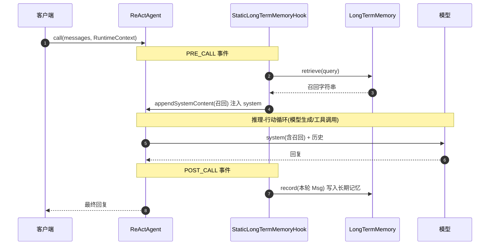
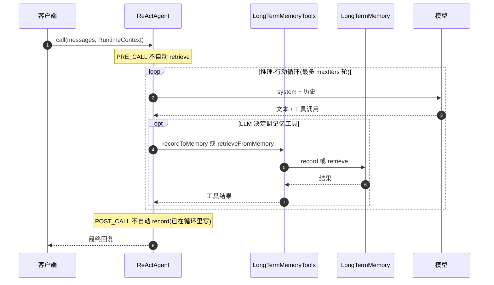
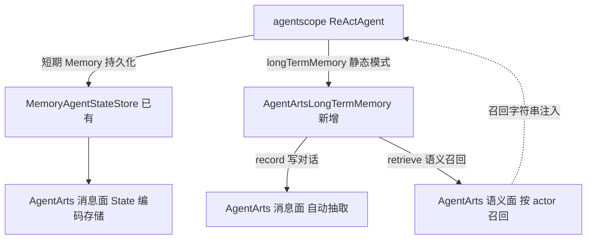
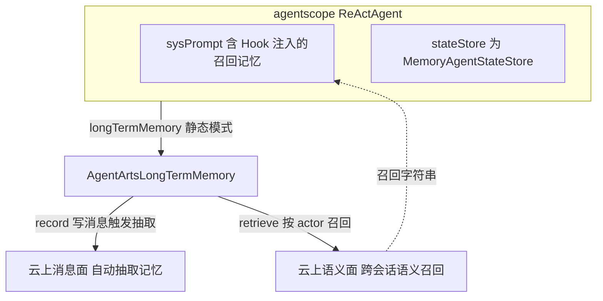

# agentscope 接入 AgentArts 云上 Memory —— 适配层设计与最佳实践

> 面向已使用 [agentscope-java](https://github.com/agentscope-ai/agentscope-java) 开发 Agent、
> 并希望接入华为云 AgentArts 云上 Memory 能力的客户。
>
> 本文叙事顺序：**先讲 agentscope 自身的记忆体系与工作流程 → 再讲基于平台怎么对接 → 最后给出最佳方式**。
>
> 接口签名均取自本仓库实际依赖的 `io.agentscope:agentscope-core:2.0.0-RC4`（用 `javap` 拆 jar 核实），
> 不臆测。

---

## 1. 背景与目标

客户的现状：用 agentscope-java 构建 Agent，使用了 agentscope 的记忆能力，目前记忆是**进程内 / 本地**的，
跨会话、跨实例、跨时间无法共享。

目标：通过 AgentArts Java SDK，把 agentscope Agent 的记忆接到**云上 Memory**，获得：

- **跨会话 / 跨实例持久化** —— 任何 Runtime 实例都能读到同一用户的记忆。
- **自动语义抽取** —— 云上从对话中自动抽取 semantic / user_preference / episodic 记忆。
- **按 actor 隔离与语义检索** —— 多用户天然隔离，按相关性召回。

---

## 2. agentscope 的记忆体系与工作流程

> ⚠️ **纠正一个常见误区**：agentscope 的"记忆"**不是 `AgentStateStore`**。
> `AgentStateStore` 只是底层状态持久化接口；agentscope 的记忆体系是
> `io.agentscope.core.memory` 包下的 **`Memory`（短期，对应 MemoryBase）** 与
> **`LongTermMemory`（长期，对应 LongMemoryBase）** 两套接口。

### 2.1 两个层次：短期 Memory vs 长期 LongTermMemory

| 接口 | 角色 | 方法 | 默认实现 |
|------|------|------|----------|
| **`Memory`**（短期 / 工作记忆） | 当前会话的对话消息缓冲 | `addMessage(Msg)` / `getMessages()` / `deleteMessage(int)` / `clear()` / `saveTo(AgentStateStore,…)` / `loadFrom(AgentStateStore,…)` | `InMemoryMemory`（进程内）；另有 `StateBackedMemory`、`AgentStateMemoryView` |
| **`LongTermMemory`**（长期记忆） | 跨会话的语义记忆，写入 + 召回 | `record(List<Msg>) → Mono<Void>` / `retrieve(Msg) → Mono<String>` | 由用户实现（本文用 AgentArts） |

```java
public interface Memory {
    void addMessage(Msg message);
    List<Msg> getMessages();
    void deleteMessage(int index);
    void clear();
    void saveTo(AgentStateStore store, String userId, String sessionId);  // 持久化短期记忆
    void loadFrom(AgentStateStore store, String userId, String sessionId); // 恢复短期记忆
}

public interface LongTermMemory {
    Mono<Void>   record(List<Msg> messages);   // 写入长期记忆（异步）
    Mono<String> retrieve(Msg query);          // 召回相关长期记忆，返回可注入 Prompt 的字符串
}
```

**关键关系**：`Memory.saveTo/loadFrom` 的后端就是 `AgentStateStore`。所以"让短期对话记忆持久化到云上"
= 把 `AgentStateStore` 换成云上实现（本 SDK 的 `MemoryAgentStateStore`，见 4.2）。**短期记忆与长期记忆
是两条正交的接入路径**，都汇入 AgentArts Memory。

**框架自带的实现类**（`javap` 全 jar 扫描核实，`agentscope-core:2.0.0-RC4`）：

| 接口 | 实现类 | 构造 | 说明 |
|------|--------|------|------|
| `Memory`（短期） | `InMemoryMemory` | `new InMemoryMemory()` | **默认**。进程内 `List<Msg>`，重启即失 |
| `Memory`（短期） | `StateBackedMemory` | `new StateBackedMemory(AgentState)` | 把消息存进一个 `AgentState`，随 state 一起 `saveTo/loadFrom` |
| `Memory`（短期） | `AgentStateMemoryView` | `new AgentStateMemoryView(Supplier<AgentState>)` | 对外部 `AgentState` 的只读视图（不持有数据） |
| `LongTermMemory`（长期） | ——（无内置实现） | —— | **纯 SPI 接口**，core 不提供后端实现，由用户/平台对接（这正是 `AgentArtsLongTermMemory` 的定位） |

> 即：短期记忆框架给了 3 个开箱即用的实现；长期记忆框架只给接口 + Hook + Tools + Mode，
> **后端必须自己实现**——这也正是本 SDK 提供 `AgentArtsLongTermMemory`（对接 AgentArts 云上 Memory）的原因。

### 2.2 LongTermMemory 的三种模式

agentscope 用 `LongTermMemoryMode` 枚举决定长期记忆"由谁触发"：

```java
public enum LongTermMemoryMode {
    AGENT_CONTROL,   // 由 LLM 决定何时记忆/召回（通过工具）
    STATIC_CONTROL,  // 由 Hook 在生命周期事件点自动记忆/召回
    BOTH             // 两者兼有
}
```

| 模式 | 触发方 | 机制 |
|------|--------|------|
| **STATIC_CONTROL** | 框架自动 | `StaticLongTermMemoryHook`（implements `Hook`）在 `PRE_CALL`/`POST_CALL` 等事件点自动调 `record`/`retrieve`，并把召回结果 `appendSystemContent` 注入 system 消息 |
| **AGENT_CONTROL** | LLM 决策 | `LongTermMemoryTools`（`recordToMemory`/`retrieveFromMemory`，`@Tool` 注解）被注册为工具，LLM 自主调用 |
| **BOTH** | 两者 | 同时挂 Hook + 注册工具 |

> **两种模式下 `record`/`retrieve` 的实现有无差异？**（字节码核实 `LongTermMemoryTools`）
>
> - **retrieve 实现无差异**：`retrieveFromMemory(queries)` 只是把 LLM 给的关键词
>   `String.join` 拼成一个字符串、包成 Msg、调 `ltm.retrieve(msg)`——与 STATIC 模式 Hook 调的是
>   **同一个方法**。差异仅在调用方与 query 来源（原始输入 vs LLM 关键词）。
> - **提取(抽取)仍由后端做，无法跳过**：`recordToMemory(summary, messages)` 把 LLM 给的 `summary`
>   包成 ASSISTANT Msg、messages 包成 USER Msg，调 `ltm.record(List)`。AgentArts 没有"直接写 Memory"
>   的 API，Memory 资源**只能由云上从消息抽取产生**，故两种模式后端都提取。
> - 真实差异在 **record 的输入**：STATIC 把原始多轮对话交给云上抽取；AGENT 是 LLM 先总结成 `summary`
>   再交云上抽取（输入更聚焦，但依赖 LLM 主动调工具，漏调则漏记）。
> - **结论**：`AgentArtsLongTermMemory` 的 `record`/`retrieve` 无需为模式改逻辑，模式差异全在框架侧。

相关类（`javap` 核实）：

```java
public class StaticLongTermMemoryHook implements Hook {
    public StaticLongTermMemoryHook(LongTermMemory ltm, Memory memory);
    public StaticLongTermMemoryHook(LongTermMemory ltm, Memory memory, boolean asyncRecord);
    public <T extends HookEvent> Mono<T> onEvent(T event);   // 在事件点 record/retrieve + appendSystemContent
}

public class LongTermMemoryTools {                            // AGENT_CONTROL 模式的工具
    public LongTermMemoryTools(LongTermMemory ltm);
    public Mono<String> recordToMemory(String summary, List<String> messages);   // @Tool
    public Mono<String> retrieveFromMemory(List<String> queries);                 // @Tool
}
```

`HookEvent` 提供 `getMemory()`、`getSystemMessage()`/`setSystemMessage(Msg)`、`appendSystemContent(String)`
—— **这就是召回记忆注入 Prompt 的官方机制**，无需自己改 system prompt。

### 2.3 一次调用的工作流程

两种模式的 record/retrieve 触发时机不同，分开画。

#### STATIC_CONTROL 模式（框架自动，零侵入）



#### AGENT_CONTROL 模式（LLM 自主调用工具）



> **两种模式的核心区别**：
> - **STATIC_CONTROL**：框架在 `PRE_CALL` 自动 `retrieve` 并 `appendSystemContent` 注入，
>   在 `POST_CALL` 自动 `record`。LLM 无感，零侵入。
> - **AGENT_CONTROL**：`retrieve`/`record` 不在事件点触发，而是 LLM 在推理-行动循环里
>   **自主调用** `LongTermMemoryTools` 的 `retrieveFromMemory`/`recordToMemory` 工具。
>   灵活但依赖模型主动调用，可能漏调。
> - 共同点：无论哪种模式，最终都落到同一个 `LongTermMemory`（本实现 `AgentArtsLongTermMemory`）
>   的 `record`/`retrieve`，即都接入 AgentArts 云上 Memory。

> **两个接入点**：① `LongTermMemory.record/retrieve`（长期记忆）② `Memory.saveTo/loadFrom` 的后端
> `AgentStateStore`（短期记忆持久化）。把它们换成 AgentArts 实现，记忆就上了云。

### 2.4 ReActAgent 的原生接入点

`ReActAgent.Builder` 原生支持长期记忆，**无需手写 Hook/工具注册**：

```java
ReActAgent.builder()
    .name("nav-agent").sysPrompt(...).model(model).toolkit(toolkit)
    .stateStore(...)                                  // 短期 Memory 的持久化后端
    .longTermMemory(myLongTermMemory)                 // ★ 长期记忆实现
    .longTermMemoryMode(LongTermMemoryMode.STATIC_CONTROL)  // ★ 选模式
    .longTermMemoryAsyncRecord(true)                  // 可选：异步 record
    .build();
```

builder 会按 `longTermMemoryMode` 自动挂 `StaticLongTermMemoryHook`（STATIC）和/或注册
`LongTermMemoryTools`（AGENT）。**我们只需实现 `LongTermMemory` 接口本身。**

> ✅ 已用 `LongTermMemoryWiringTest` 验证：`.longTermMemoryMode(STATIC_CONTROL)` 确实自动注册了
> `StaticLongTermMemoryHook`（查 `agent.getHooks()`），故 record/retrieve 会在调用中被触发。

---

## 3. AgentArts 云上 Memory 模型

双平面架构：

- **控制平面（AK/SK 签名）**：`createSpace` / `createApiKey` 等。Space 创建时启用内置抽取策略
  （`semantic` / `user_preference` / `episodic`）。
- **数据平面（API Key 认证）**：
  - **Session**：`createMemorySession`，按 actor 聚合。
  - **Message**：`addMessages` / `getLastKMessages` / `listMessages` —— OpenAI "parts" 格式，**写入触发云上自动抽取**。
  - **Memory**：`searchMemories`（带 `query` / `actor_id` / `topK` / `min_score` 等过滤）/ `listMemories` / `getMemory` / `deleteMemory` —— 已抽取的长期记忆，按 actor 跨会话语义检索。

> AgentArts Memory = 消息面（写入即抽取）+ 语义记忆面（按 actor 跨会话检索）。天然对应
> agentscope `LongTermMemory.record`（写消息→抽取）与 `retrieve`（语义召回）。

---

## 4. 对接实现

适配层在 `agentarts-sdk-integration-agentscope` 模块，**两条正交路径**：



### 4.1 长期记忆：`AgentArtsLongTermMemory implements LongTermMemory`（核心）

两个方法的映射：

| agentscope | AgentArts | 说明 |
|------------|-----------|------|
| `record(List<Msg>)` | `addMessages(TextMessage)` | Msg → TextMessage（role + text），写入云上消息面，**触发自动抽取** semantic/user_preference/episodic |
| `retrieve(Msg)` | `searchMemories(query, actor_id, topK)` | 用 Msg 文本作 query，按 actor **跨会话**召回，格式化为字符串返回（被 Hook `appendSystemContent` 注入） |

实现要点（见 `memory/AgentArtsLongTermMemory.java`）：

- **actor 维度**：记忆按 `actorId` 隔离与召回。云上 `searchMemories` 只传 `actor_id`、不传 `session_id`，
  从而跨会话召回。一个 LTM 实例绑定一个 actor；多用户场景应每用户一个实例（或用 PRE_CALL 钩子把
  `RuntimeContext.userId` 透传到上下文相关实现）。
- **异步**：`record`/`retrieve` 返回 `Mono`，在 `Schedulers.boundedElastic()` 上执行，配合
  `longTermMemoryAsyncRecord` 不阻塞主流程。
- **容错**：`record` 失败 `onErrorResume` 吞掉（记忆不应让主对话挂掉）；`retrieve` 失败返回空串。
- **角色映射**：`MsgRole.USER/ASSISTANT/SYSTEM/TOOL` → `"user"/"assistant"/"system"/"tool"`。
- **抽取延迟**：`record` 写消息后云上**异步抽取**（秒~分钟级），立即 `retrieve` 可能为空。
  `record` 用 `forceExtract=true` 尽快触发；紧邻的"写完就查"场景由**调用方**轮询 `retrieve` 兜底
  （demo 里的 `waitForRecall` 是使用方胶水代码，不进适配层——适配层只暴露 `record`/`retrieve` 契约）。
  （`searchMemories` 的返回解析是适配层内部细节，已封装，用户不感知。）

### 4.2 短期记忆持久化：`MemoryAgentStateStore`（已有）

`Memory.saveTo/loadFrom(stateStore,…)` 的后端换成云上：

```java
.stateStore(new MemoryAgentStateStore(memoryClient, spaceId))
```

它把 `AgentStateStore` 的 8 个方法映射到云上消息面（State JSON 编码为 `__S__:`/`__L__:` 文本消息，
列表用 `__LB__` 批次标记实现全量替换），让**短期对话记忆 + Agent 工作状态**跨实例落盘。

### 4.3 三种模式的接线

```java
MemoryClient client = new MemoryClient(region, memoryApiKey);
String spaceId = ...;
String actorId = userId;   // 来自 RuntimeContext

LongTermMemory ltm = new AgentArtsLongTermMemory(client, spaceId, actorId);

ReActAgent agent = ReActAgent.builder()
        .name("nav-agent").sysPrompt(BASE_PROMPT).model(model).toolkit(toolkit)
        .stateStore(new MemoryAgentStateStore(client, spaceId))            // 短期记忆持久化
        .longTermMemory(ltm)                                               // 长期记忆
        .longTermMemoryMode(LongTermMemoryMode.STATIC_CONTROL)            // 模式
        .build();
```

- **STATIC_CONTROL**（推荐起步）：自动 record/retrieve + 注入，零侵入，LLM 无需学会"调记忆工具"。
- **AGENT_CONTROL**：LLM 自主决定何时记忆/召回，灵活但依赖模型能力，可能漏调。
- **BOTH**：两者兼有。

### 4.4 与 mem0 实现的对比（客户从 mem0 迁移参考）

agentscope 官方扩展 `agentscope-extensions-mem0` 提供了 `Mem0LongTermMemory`（`implements LongTermMemory`），
与本实现 `AgentArtsLongTermMemory` 实现**同一接口**，可互换。二者对照如下（参考 mem0 源码）：

| 维度 | `Mem0LongTermMemory`（mem0） | `AgentArtsLongTermMemory`（本实现） |
|------|------------------------------|--------------------------------------|
| 契约 | `implements LongTermMemory`（record/retrieve） | **同**（可互换，业务侧只换实现类） |
| 后端 | 外部 mem0 服务（platform 或 self-hosted），需单独部署 + `MEM0_API_KEY` | 华为云 AgentArts Memory（托管，AK/SK + API Key，无需自部署） |
| 抽取时机 | `add` 默认 `async_mode=true` **异步**抽取（可选 `async_mode=false` 同步）；`infer=true` 用 LLM 抽取 | `addMessages(forceExtract=true)` **异步**抽取（forceExtract 尽快触发，但不阻塞到完成）。两者默认都异步，"写完立刻查"都可能要轮询/等下一轮 |
| 隔离维度 | `agentId` / `userId` / `runId` / `metadata`（多租户；`metadata` **可直接作检索过滤**） | `actorId` / `assistantId` / `sessionId` / `strategy_type` 等；**同样支持自定义 meta**：消息级 `TextMessage.meta`(String) + session 级 `meta`(Map) 可写入自定义元数据；`searchMemories` 按 actor/session/strategy 等结构维度过滤 |
| record 角色 | USER,SYSTEM→`user`；ASSISTANT,TOOL→`assistant` | 保留原角色：`user`/`assistant`/`system`/`tool` |
| retrieve 返回 | 各记忆 `getMemory()` 文本，`\n` 拼接 | 含 `memory_type` + `score` 的格式化串（便于调试与排序） |
| 特殊过滤 | 过滤 `<compressed_history>` 等 agentscope 内部压缩标记 | 过滤空文本（可按需补 `<compressed_history>`） |
| 容错 | `retrieve` `onErrorReturn("")` | **同**：`retrieve` 失败返回空串；`record` 失败 `onErrorResume` 吞掉 |
| 模式接入 | `.longTermMemory(mem0LTM).longTermMemoryMode(...)` | **同**（框架层无差异，STATIC/AGENT/BOTH 通用） |
| 迁移成本 | — | 接口相同，把 `Mem0LongTermMemory.builder()...build()` 换成 `new AgentArtsLongTermMemory(client, spaceId, actorId)` 即可 |

**迁移要点**（mem0 → AgentArts）：

1. **接口不变**：都 `implements LongTermMemory`，`.longTermMemory(...)` 接法不变，模式不变。
2. **抽取时序基本一致**：mem0 默认 `async_mode=true` 也是异步抽取，和 AgentArts 一样；
   mem0 可选 `async_mode=false` 走同步，AgentArts 则用 `forceExtract=true` 尽快触发 + 调用方按需轮询 `retrieve`。
   差异不大——"写完立刻查"的场景两者都要处理抽取延迟。
3. **隔离模型简化**：mem0 的 `agentId/userId/runId/metadata` → AgentArts 的 `actorId`（用户级），
   云端按 actor 跨会话召回；多租户用不同 actor 即可。
4. **后端免运维**：mem0 要自己部署/运维 mem0 服务；AgentArts 是云上托管，开箱即用。

---

## 5. 接口差异对照

| 维度 | agentscope `LongTermMemory` | AgentArts Memory | 适配要点 |
|------|------------------------------|------------------|----------|
| 写入 | `record(List<Msg>)` | `addMessages(TextMessage)` | Msg→TextMessage（role+text），写入即触发抽取 |
| 召回 | `retrieve(Msg) → Mono<String>` | `searchMemories(query, actor, topK) → 记忆列表` | 用 Msg 文本作 query，按 actor 召回，格式化为字符串 |
| 隔离维度 | 接口未显式带 actor | `actor_id` 过滤 | 适配层在构造时绑定 actor，retrieve 传 actor_id |
| 抽取 | 无（接口只管 record/retrieve） | 自动（semantic/user_preference/episodic） | 云上在 record 后自动抽取，retrieve 检索的是抽取结果 |
| 触发时机 | 由 `LongTermMemoryMode`（Hook/工具） | n/a | 模式决定 record/retrieve 何时被调 |
| 异步 | `Mono` | 同步 API（addMessages/searchMemories） | 适配层在 `boundedElastic` 上包装为 `Mono` |
| 短期记忆 | `Memory.saveTo/loadFrom` | 消息面 | 经 `MemoryAgentStateStore`（State 编码存储） |

---

## 6. 最佳方式

### 6.1 推荐架构



### 6.2 最佳实践

1. **实现 `LongTermMemory`，不自造接口** —— 复用 agentscope 原生模式（Hook/工具/Builder），
   升级 agentscope 版本不受影响，零侵入。
2. **起步用 STATIC_CONTROL** —— 自动 record/retrieve + `appendSystemContent` 注入，最省心；
   确有"让模型主动决定记忆"的需求再切 AGENT_CONTROL/BOTH。
3. **按 actor 隔离 + 跨会话召回** —— `actorId` 用稳定用户 ID；`searchMemories` 只按 actor、
   不按 session，实现"换会话也不忘"。
4. **写即抽取** —— 每轮 user/assistant 都 `record`，让云上自动抽取，不要自己写抽取链路。
5. **召回而非全量** —— `retrieve` 用 `topK=3~5`，只注入相关记忆，控制 token 成本与噪声。
6. **短期/长期分离** —— 短期对话走 `Memory`(→`MemoryAgentStateStore`)，长期语义走
   `LongTermMemory`(→`AgentArtsLongTermMemory`)，正交勿混。
7. **异步 + 容错** —— `longTermMemoryAsyncRecord(true)`；`record`/`retrieve` 失败降级，不影响主对话。
8. **可降级** —— 无云凭据时用 `InMemoryLongTermMemory`（离线 demo/本地开发），上云换实现类即可。

### 6.3 为什么这是最佳方式

- **原生契合**：`LongTermMemory` 是 agentscope 为"长期记忆"设计的官方接口，`record`/`retrieve`
  与 AgentArts 的"写消息即抽取 / 语义召回"一一对应，无语义损失。
- **最小代码**：只实现 2 个方法，模式/Hook/工具/注入全用 agentscope 自带。
- **职责正交**：短期（Memory+AgentStateStore）与长期（LongTermMemory）各走各的云上通道。
- **复用云上能力**：自动抽取 + 语义检索，不重复造 embedding 轮子。

---

## 7. 导航场景 Demo

**代码**：`agentarts-sdk-examples/.../memory/NavigationLongTermMemoryDemo.java`（双路径）

### 7.1 场景

- 会话 A：`record` 用户画像（家/公司位置 + 避开高速偏好）→ 云上抽取 semantic/user_preference。
- 会话 B（**全新会话**）：`retrieve("导航去公司")` → 按 actor 跨会话召回公司位置 + 偏好 → 给路线。
- 对照：另一用户 `retrieve` 为空 → 提示信息不足。

### 7.2 运行（`.env` + 一键脚本）

demo 的所有环境变量写在 `agentarts-sdk-examples/.env`（已 gitignore，不入库），用 `run-demo.sh` 自动加载：

```bash
cd agentarts-sdk-examples

# 1) 一次性：从模板建 .env 并填入你的值
cp .env.example .env
#   编辑 .env，填：
#     OPENAI_API_KEY / OPENAI_BASE_URL / OPENAI_MODEL_NAME   (LLM，不填则脚本驱动模式)
#     AGENTARTS_MEMORY_API_KEY / AGENTARTS_MEMORY_SPACE_ID   (云上记忆，不填则离线)
#     HUAWEICLOUD_SDK_AK / SK / REGION                       (仅建 Space 时需要)

# 2) 跑（自动加载 .env，首次自动 install SDK）
./run-demo.sh              # 默认导航 demo
./run-demo.sh nav          # 同上
# 也支持: memory / agentscope / basic / com.huaweicloud.Xxx 完整类名
```

demo 根据 `.env` **自动选模式**：

| `.env` 配置 | 运行模式 |
|-------------|----------|
| 都不填 | 离线脚本驱动（`InMemoryLongTermMemory`），零凭据开箱即跑 |
| 只填 `AGENTARTS_MEMORY_*` | 脚本驱动 + 真实云上记忆（`waitForRecall` 等抽取） |
| 填 `OPENAI_API_KEY`（+ 云上记忆） | **真实 ReActAgent + STATIC_CONTROL + 云上记忆**（完整场景） |

> `OPENAI_BASE_URL` 可对接任意 OpenAI 兼容端点（阿里云百炼 / 华为云 MaaS / DeepSeek / 本地 Ollama）。

### 7.3 预期观察（真实云上 + LLM 已验证）

- 会话 A：`record` 用户画像 → 云上自动抽取记忆（`<global_summary>` / `{"fact":...}` 等）。
- 会话 B（**全新会话**）：STATIC_CONTROL Hook 在 `agent.call()` 的 `PRE_CALL` 自动调 `retrieve`，
  召回到会话 A 写入的公司位置 + 避开高速偏好（`LoggingLongTermMemory` 装饰器把这次调用打印可见），
  并 `appendSystemContent` 注入 system → LLM 据此直接给出前往公司（国贸）、避开高速的路线。
- 对照：无相关记忆的 actor `retrieve` 为空 → LLM 提示信息不足。

> 真实运行实测：第二轮 LLM 回复"已为您调用保存的通勤信息，正在为您规划前往公司（国贸）的路线，
> 已自动应用您避开高速公路的偏好"——证明云上召回的记忆确实被注入并被 LLM 使用。

---

## 8. 文件清单

| 文件 | 角色 |
|------|------|
| `integration-agentscope/.../memory/AgentArtsLongTermMemory.java` | **核心**：implements agentscope `LongTermMemory`，对接云上 |
| `integration-agentscope/.../memory/InMemoryLongTermMemory.java` | 离线实现（demo/单测） |
| `integration-agentscope/.../state/MemoryAgentStateStore.java` | 短期 Memory 持久化后端（已有） |
| `integration-agentscope/.../message/MessageConverter.java` | 消息双向转换（已有） |
| `integration-agentscope/.../runtime/AgentscopeRuntimeHost.java` | Runtime 桥接（已有） |
| `integration-agentscope/.../LongTermMemoryTest.java` | 适配层单测（12 例，不触网不依赖 LLM） |
| `integration-agentscope/.../LongTermMemoryWiringTest.java` | 验证 STATIC_CONTROL 自动注册 Hook（3 例） |
| `examples/.../memory/NavigationLongTermMemoryDemo.java` | 导航场景 Demo（双路径） |
| `examples/.../memory/LoggingLongTermMemory.java` | 可观测装饰器（打印 record/retrieve 调用） |
| `examples/.env.example` / `examples/run-demo.sh` | 环境变量模板 + 一键运行脚本 |
